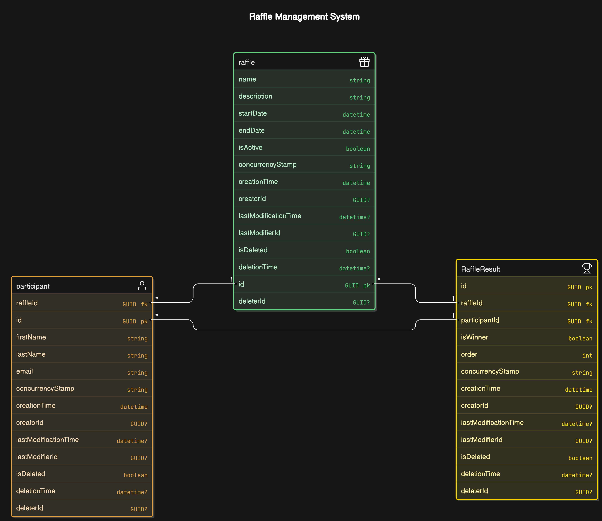

# YazilimAcademy.ABPRaffleApp

## Database Diagram



## About this solution

This is a layered startup solution based on [Domain Driven Design (DDD)](https://docs.abp.io/en/abp/latest/Domain-Driven-Design) practises. All the fundamental ABP modules are already installed. Check the [Application Startup Template](https://abp.io/docs/latest/startup-templates/application/index) documentation for more info.

### Pre-requirements

* [.NET9.0+ SDK](https://dotnet.microsoft.com/download/dotnet)
* [Node v18 or 20](https://nodejs.org/en)

### Configurations

The solution comes with a default configuration that works out of the box. However, you may consider to change the following configuration before running your solution:

* Check the `ConnectionStrings` in `appsettings.json` files under the `YazilimAcademy.ABPRaffleApp.HttpApi.Host` and `YazilimAcademy.ABPRaffleApp.DbMigrator` projects and change it if you need.

### Before running the application

* Run `abp install-libs` command on your solution folder to install client-side package dependencies. This step is automatically done when you create a new solution, if you didn't especially disabled it. However, you should run it yourself if you have first cloned this solution from your source control, or added a new client-side package dependency to your solution.
* Run `YazilimAcademy.ABPRaffleApp.DbMigrator` to create the initial database. This step is also automatically done when you create a new solution, if you didn't especially disabled it. This should be done in the first run. It is also needed if a new database migration is added to the solution later.

#### Generating a Signing Certificate

In the production environment, you need to use a production signing certificate. ABP Framework sets up signing and encryption certificates in your application and expects an `openiddict.pfx` file in your application.

To generate a signing certificate, you can use the following command:

```bash
dotnet dev-certs https -v -ep openiddict.pfx -p 587c0a19-d458-4bef-b289-7c5ea8be0994
```

> `587c0a19-d458-4bef-b289-7c5ea8be0994` is the password of the certificate, you can change it to any password you want.

It is recommended to use **two** RSA certificates, distinct from the certificate(s) used for HTTPS: one for encryption, one for signing.

For more information, please refer to: [https://documentation.openiddict.com/configuration/encryption-and-signing-credentials.html#registering-a-certificate-recommended-for-production-ready-scenarios](https://documentation.openiddict.com/configuration/encryption-and-signing-credentials.html#registering-a-certificate-recommended-for-production-ready-scenarios)

> Also, see the [Configuring OpenIddict](https://docs.abp.io/en/abp/latest/Deployment/Configuring-OpenIddict#production-environment) documentation for more information.

### Solution structure

This is a layered monolith application that consists of the following applications:

* `YazilimAcademy.ABPRaffleApp.DbMigrator`: A console application which applies the migrations and also seeds the initial data. It is useful on development as well as on production environment.
** `YazilimAcademy.ABPRaffleApp.HttpApi.Host`: ASP.NET Core API application that is used to expose the APIs to the clients.
* `YazilimAcademy.ABPRaffleApp.Blazor`: ASP.NET Core Blazor Server application that is the essential web application of the solution.


## Deploying the application

Deploying an ABP application is not different than deploying any .NET or ASP.NET Core application. However, there are some topics that you should care about when you are deploying your applications. You can check ABP's [Deployment documentation](https://docs.abp.io/en/abp/latest/Deployment/Index) and ABP Commercial's [Deployment documentation](https://abp.io/docs/latest/startup-templates/application/deployment?UI=MVC&DB=EF&Tiered=No) before deploying your application.

### Additional resources

You can see the following resources to learn more about your solution and the ABP Framework:

* [Web Application Development Tutorial](https://abp.io/docs/latest/tutorials/book-store/part-1)
* [Application Startup Template](https://abp.io/docs/latest/startup-templates/application/index)
* [LeptonX Theme Module](https://abp.io/docs/latest/themes/lepton-x/index)
* [LeptonX Blazor UI](https://abp.io/docs/latest/themes/lepton-x/blazor?UI=Blazor)


